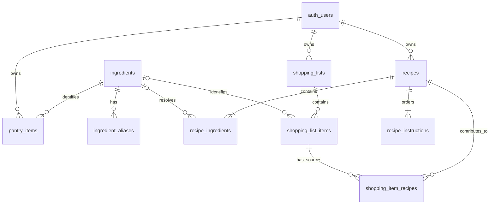

# Database

## Status and conventions

This is the **proposed schema**, based on the [Fridge](services/fridge.md),
[Recipe](services/recipe.md), [Matching](services/matching.md), and
[Shopping](services/shopping.md) requirements. The development scaffold and migration
runner exist, but no business tables or SQL migrations are implemented. These constraints and access rules
are design requirements, not deployed guarantees.

Supabase `auth.users` supplies identities. All application tables belong to
`public`; no separate application user table is proposed.

- Every `id` column is a UUID primary key, defaulting to `gen_random_uuid()`.
- Timestamps use `TIMESTAMPTZ`. The application must refresh `updated_at` on changes;
  its creation default does not automatically update it.
- Quantities use `NUMERIC` to preserve fractional values without floating-point rounding.
- **Required** means `NOT NULL`; `—` means no default. Foreign keys have no generated default.
- Required names, labels, URLs, units, and instruction text must be nonblank.
- Known weight and volume quantities use `g` and `ml`; counts use `count`.
  Natural and approximate units such as `clove`, `bunch`, `pinch`, and `to taste`
  remain meaningful units. Unknown quantities are `NULL`, never an invented zero.

## Relationships

`auth_users` represents Supabase `auth.users`. Scraped recipes are stored directly
in each user's recipe tables, with no separate scraped-recipe catalog.

The recipe service must save at least one ingredient and one instruction in the
same transaction as the recipe. Ordinary foreign keys alone cannot enforce this
minimum child count. Recipe children inherit ownership through their recipe;
shopping items inherit ownership through their list.

## ingredients

Shared canonical ingredient master data.

| Column | Type | Required | Default | Description |
|---|---|---|---|---|
| id | UUID | Yes | `gen_random_uuid()` | Primary key |
| name | TEXT | Yes | — | Canonical ingredient name |
| category | TEXT | No | — | Ingredient category |
| measurement_type | TEXT | Yes | — | `WEIGHT`, `VOLUME`, `COUNT`, `NATURAL`, or `APPROXIMATE` |
| created_at | TIMESTAMPTZ | Yes | `now()` | Creation time |

Use a check constraint for measurement type and a unique expression index on
`lower(btrim(name))`. Measurement type guides interpretation; it does not justify
conversion between weight and volume without ingredient-specific information.

## ingredient_aliases

Alternative names used during recipe normalisation. Pantry items reference the
canonical ingredient directly.

| Column | Type | Required | Default | Description |
|---|---|---|---|---|
| id | UUID | Yes | `gen_random_uuid()` | Primary key |
| ingredient_id | UUID | Yes | — | FK to `ingredients.id` |
| alias | TEXT | Yes | — | Alternative ingredient name |

Use a unique expression index on `lower(btrim(alias))` so an alias cannot resolve
to multiple ingredients. Catalog maintenance must also reject aliases matching
another ingredient's canonical name; separate table indexes cannot enforce this
cross-table rule. Examples: scallion → Spring Onion, whole milk → Milk, and
garbanzo beans → Chickpeas.

## pantry_items

Ingredients currently owned by a user.

| Column | Type | Required | Default | Description |
|---|---|---|---|---|
| id | UUID | Yes | `gen_random_uuid()` | Primary key |
| user_id | UUID | Yes | — | FK to `auth.users.id` |
| ingredient_id | UUID | Yes | — | FK to `ingredients.id` |
| quantity | NUMERIC | Yes | — | Current quantity; check `quantity >= 0` |
| unit | TEXT | Yes | — | Canonical or retained natural/approximate unit |
| expiry_date | DATE | No | — | Optional expiry date |
| created_at | TIMESTAMPTZ | Yes | `now()` | Creation time |
| updated_at | TIMESTAMPTZ | Yes | `now()` | Last modification time |

Adding requires a quantity greater than zero. Updates may reach zero, consistent
with the fridge rule that quantities cannot be negative. The service merges
compatible duplicate ingredients after unit normalisation. Do not enforce
uniqueness on `(user_id, ingredient_id)` because units may be incompatible.
Expiry handling during a merge requires a service decision before implementation.

## recipes

One user's successfully imported recipe, including its original source.

| Column | Type | Required | Default | Description |
|---|---|---|---|---|
| id | UUID | Yes | `gen_random_uuid()` | Primary key |
| user_id | UUID | Yes | — | FK to `auth.users.id` |
| name | TEXT | Yes | — | Recipe title |
| description | TEXT | No | — | Source description |
| source_url | TEXT | Yes | — | Validated source URL used for duplicate lookup |
| source_website | TEXT | No | — | Source website name |
| image_url | TEXT | No | — | Source image URL |
| serving_size | TEXT | No | — | Original yield, e.g. `4 servings` or `1 loaf` |
| prep_time_minutes | NUMERIC | No | — | Preparation duration; check `>= 0` |
| cook_time_minutes | NUMERIC | No | — | Cooking duration; check `>= 0` |
| total_time_minutes | NUMERIC | No | — | Source total duration; check `>= 0` |
| created_at | TIMESTAMPTZ | Yes | `now()` | Import time |
| updated_at | TIMESTAMPTZ | Yes | `now()` | Last modification time |

Enforce `UNIQUE (user_id, source_url)`. Reimporting the same URL returns that user's
existing recipe, including when concurrent imports race. Different users may
import the same URL. This proposal compares stored URL strings; equivalence
across redirects or tracking parameters is not defined.

Do not assume total time equals preparation plus cooking time: source durations
may overlap or include waiting. Failed imports create no recipe. Suggested import
statuses in the recipe service documentation are not persisted here; asynchronous
import jobs would require a separate design.

## recipe_ingredients

Ordered source ingredients with optional canonical resolution and normalisation.

| Column | Type | Required | Default | Description |
|---|---|---|---|---|
| id | UUID | Yes | `gen_random_uuid()` | Primary key |
| recipe_id | UUID | Yes | — | FK to `recipes.id` |
| ingredient_id | UUID | No | — | FK to `ingredients.id`; `NULL` means unresolved |
| position | INTEGER | Yes | — | Source order; check `position > 0` |
| original_text | TEXT | Yes | — | Complete source line preserved verbatim |
| original_quantity | NUMERIC | No | — | Parsed source quantity; check `> 0` when present |
| original_unit | TEXT | No | — | Source unit in its original wording |
| normalised_quantity | NUMERIC | No | — | Comparable quantity; check `> 0` when present |
| normalised_unit | TEXT | No | — | `g`, `ml`, `count`, or retained natural/approximate unit |

Enforce `UNIQUE (recipe_id, position)`. A normalised quantity requires a normalised
unit; a unit may exist without a quantity, as with `to taste`. A parsed original
quantity may lack an explicit original unit, as with `2 eggs`.

Preserve source text even when ranges or other expressions cannot be parsed
reliably. Canonical resolution and quantity parsing are independent: either may
succeed without the other. Repeated canonical ingredients are allowed, for
example flour used in both dough and sauce.

## recipe_instructions

Instructions stored in source order.

| Column | Type | Required | Default | Description |
|---|---|---|---|---|
| id | UUID | Yes | `gen_random_uuid()` | Primary key |
| recipe_id | UUID | Yes | — | FK to `recipes.id` |
| position | INTEGER | Yes | — | Step order; check `position > 0` |
| instruction | TEXT | Yes | — | Instruction text |

Enforce `UNIQUE (recipe_id, position)` and read in ascending position order.

## shopping_lists

Container establishing shopping-item ownership. The schema permits multiple
lists per user without requiring a multiple-list UI.

| Column | Type | Required | Default | Description |
|---|---|---|---|---|
| id | UUID | Yes | `gen_random_uuid()` | Primary key |
| user_id | UUID | Yes | — | FK to `auth.users.id` |
| created_at | TIMESTAMPTZ | Yes | `now()` | Creation time |

## shopping_list_items

Items added from missing recipe requirements or manually by the user.

| Column | Type | Required | Default | Description |
|---|---|---|---|---|
| id | UUID | Yes | `gen_random_uuid()` | Primary key |
| shopping_list_id | UUID | Yes | — | FK to `shopping_lists.id` |
| ingredient_id | UUID | No | — | FK to `ingredients.id` when recognised |
| display_name | TEXT | Yes | — | Label, including non-food manual items |
| quantity | NUMERIC | No | — | Needed quantity; check `> 0` when present |
| unit | TEXT | No | — | Canonical or retained natural/approximate unit |
| status | TEXT | Yes | `'PENDING'` | `PENDING` or `PURCHASED` |
| created_at | TIMESTAMPTZ | Yes | `now()` | Creation time |
| updated_at | TIMESTAMPTZ | Yes | `now()` | Last modification time |

Use a check constraint for status. A quantity requires a unit; an unknown quantity
may retain a unit such as `to taste`. Manual items may omit both.

The service adds only missing quantities and may combine compatible amounts.
No ingredient-only uniqueness constraint is proposed: units may be incompatible,
and purchased and pending entries may coexist. Purchasing preserves the item and
does not update pantry inventory.

## shopping_item_recipes

Provenance junction retaining each contributing recipe when shopping items merge.
Manual shopping items require no rows here.

| Column | Type | Required | Default | Description |
|---|---|---|---|---|
| shopping_list_item_id | UUID | Yes | — | FK to `shopping_list_items.id`; part of primary key |
| recipe_id | UUID | Yes | — | FK to `recipes.id`; part of primary key |

Use composite primary key `(shopping_list_item_id, recipe_id)`. Each pair appears
once even if multiple recipe lines contribute. This records provenance, not
per-recipe quantities or addition history. The recipe and shopping item's list
must belong to the same user.

## Integrity, access, and indexes

### Deletion rules

- User foreign keys use `ON DELETE CASCADE`, removing the user's pantry, recipes,
  and shopping lists when their auth identity is deleted.
- Recipe ingredients and instructions use `ON DELETE CASCADE` for their recipe FK.
- Shopping items use `ON DELETE CASCADE` for their list FK.
- Both provenance foreign keys use `ON DELETE CASCADE`. Deleting a recipe removes
  its provenance links but preserves shopping items and their quantities.
- Every foreign key to `ingredients` uses `ON DELETE RESTRICT`, including aliases.
  Referenced canonical ingredients must be retained or references explicitly resolved.

### Ownership and access

Enable row-level security on all application tables during implementation.
Authenticated users may read ingredients and aliases; catalog writes require
an administrative path.

User-owned rows require `user_id = auth.uid()` for reads, inserts, updates, and
deletes. Child policies check ownership through their parent. Provenance policies
must check both the shopping-list owner and recipe owner, including reference
updates. Apply both visibility and write checks: foreign keys alone do not
prevent cross-user links.

The Go backend must scope queries and validate relationships using the authenticated
user, especially if its database role bypasses RLS. Ownership is immutable through
normal application operations. Save recipes and children atomically; merge shopping
quantities and provenance within one transaction.

### Indexes

Primary keys and unique constraints provide their own indexes. Add these lookup
indexes; PostgreSQL does not automatically index the referencing side of a foreign key:

| Table | Additional index columns | Purpose |
|---|---|---|
| ingredient_aliases | `ingredient_id` | Ingredient lookup and reference checks |
| pantry_items | `(user_id, ingredient_id)`, `ingredient_id` | Owner inventory, matching, ingredient references |
| recipe_ingredients | `ingredient_id` | Canonical ingredient references |
| shopping_lists | `user_id` | Owner's lists |
| shopping_list_items | `(shopping_list_id, status)`, `ingredient_id` | List/status lookup and ingredient references |
| shopping_item_recipes | `recipe_id` | Recipe provenance and reference checks |

The unique `(user_id, source_url)` index supports owner recipe queries. Unique
`(recipe_id, position)` indexes support ingredient/instruction reads and recipe
foreign keys. The provenance primary key supports lookup by shopping item.

## Scenarios to validate during implementation

| Scenario | Expected representation or constraint |
|---|---|
| Scrape `2 cups whole milk` | Preserve source text, quantity `2`, and unit `cups`; resolve Milk when possible and store converted `ml` only when conversion is known |
| Unrecognised ingredient | Preserve source text with `ingredient_id = NULL` |
| `Salt to taste` | Resolve Salt when possible; quantity stays `NULL`, unit may be `to taste` |
| Ordered instructions | Positive positions, unique within the recipe; read in order |
| Repeat URL import | Return the same user's existing recipe; another user may save their own copy |
| Manual `Dishwashing Liquid` | Display name required; ingredient, quantity, unit, and provenance optional |
| Two recipes need 200 g and 300 g chicken | Merged item stores 500 g and two provenance rows |
| Delete one contributing recipe | Remove its provenance row; retain shopping item and quantity |
| Cross-user provenance link | Reject even when both foreign-key targets exist |

## Deferred schema work and documentation gaps

- **Ingredient conversions:** the previous diagram mentioned `ingredient_conversion`,
  but no columns or conversion policy are defined. Define ingredient-specific
  factors, supported directions, and precision before adding a table. Standard
  unit conversions do not inherently require per-ingredient records.
- **Approved substitutions:** the matching service describes substitutes, but
  persistence, directionality, and quantity rules still need design.
- **Import infrastructure:** no raw-page archive, shared scrape cache, or import-job
  table is included. Successful imports use the recipe tables above.

Future schema implementation requires migrations and database tests. Follow the
[database workflow](workflows/database.md); the API never applies migrations on startup.
